# <u>**Recovery Tool User Guide**</u>

This guide is meant to cover all operational aspects of the recovery tool, including but not limited to:

1. Verifying a recovery package
2. Recovering the private key material from a recovery package
3. Generating a self-serve recovery package

This guide does not cover technical aspects such as the source code, classes, architecture of flow within the software.
  

---

## <u>Table of Contents</u>

- [Purpose, Usages and Requirements](#purpose-usages-and-requirements)
- [Generate a self-serve recovery package](#generating-a-self-serve-package)
- [Verifying a recovery package](#verifying-a-recovery-package-1)
- [Recovering the private key material](#recovering-the-private-key-material)
- [Reconstructing your workspace after verification or recovery](#reconstructing-your-workspace-after-verification-or-recovery)
- [Creating a Withdrawal Transactions](#creating-a-withdrawl-transaction)
- [Changing the Settings](#configuration)

  

---

## <u>Purpose, Usages and Requirements</u>

### <u>Purpose</u>

The new recovery tool is a new version of the original [Fireblocks Key Recovery Tool](https://github.com/fireblocks/fireblocks-key-recovery-tool/) and addresses some of the downsides that the original tool had. 
Some of the major downsides of the original tool were:

- An online machine was needed to be able to send `EdDSA` transactions
- The offline machine had to be online initially to setup the tool
- Creating an `EdDSA` transaction would be cumbersome for non-technical users, requiring actual code writing and operation of the tool

These downsides would result in the operational time from getting a recovery package to gaining confidence in the tool's and user's ability to recover the keys to be rather long and the entire process drawn out with back-and-forth discussions with Fireblocks support or operation teams.

The new tool resolves these downsides by providing a simple and streamlined approach to recovering or verifying keys with minimal coding and setup required.

### <u>Usages</u>

The tool features three modes of operation, depending on your specific need:

1. Generating a Recovery Package
2. Verifying a Recovery Package
3. Recovering Private Key Material

#### <u>Generating a Recovery Package</u>

Self-serve backup can be performed from the Fireblocks Console and as part of it some steps are required.

This mode allows you to perform those steps via the tool for a step-by-step experience with little friction with the console and a detailed explanation of each operation required.
 

#### <u>Verifying a Recovery Package</u>

Part of the recovery tool's ability is to verify the recovery package itself.

The meaning of _`verify`_ in this context is to make sure that the extended public key generated by the recovery kit matches the extended public key that is expected by the recovery package. In addition, this key can be compared to the extended public key presented in the UI (assuming still accessible) for another layer of verification.

This mode can only be done on an **offline machine**.
 

#### <u>Recovering Private Key Material</u>

The most critical part of the reocvery package is to supply the ability to - **in case of disaster** - recover your workspace's private key material.

Recovering the private key is an extremely sensitive operation that will expose your private key material, which can result in a loss of funds.

This mode can only be done on an **offline machine**.

## <u>Generating a Self-Serve Package</u>

You can perform this operation on an online machine

### <u>Steps</u>

1. From the main UI select the `Generate Keys` option, or from the left-hand menu select the `Set Up` option:
   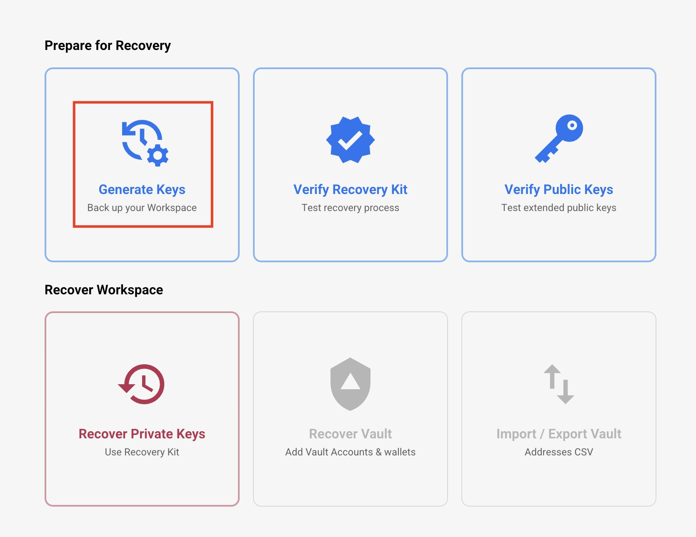
   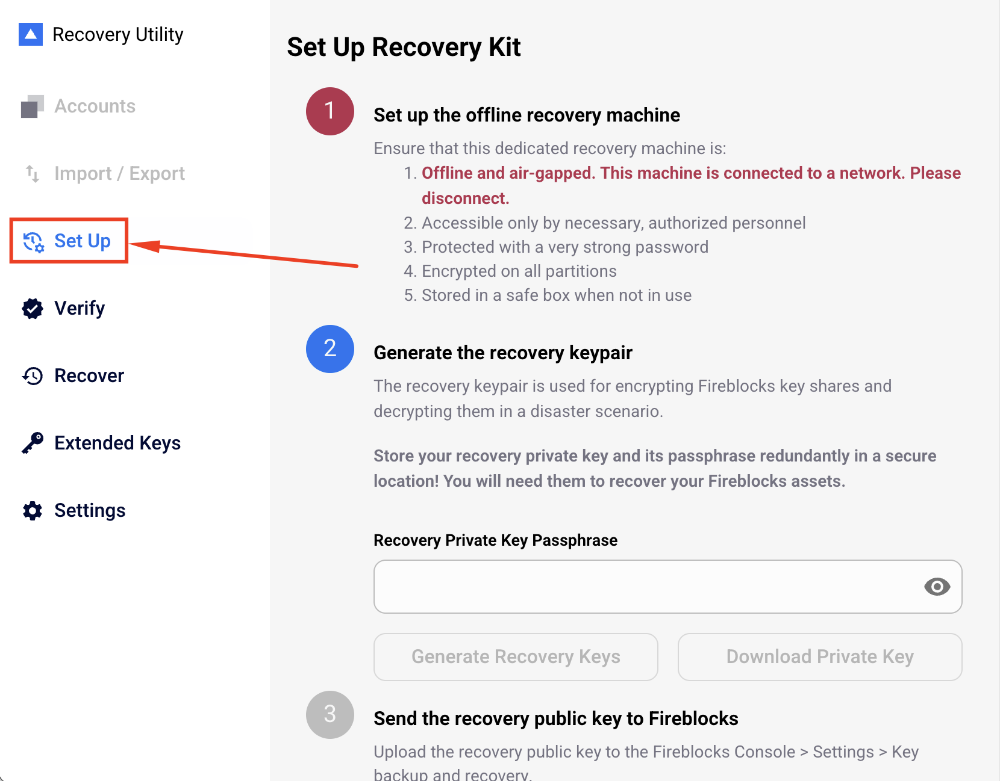

2. Follow the on-screen instructions
3. Once you finish all instructions you can verify the recovery package - this **must be done on an offline machine**

 

---

## <u>Verifying a Recovery Package</u>

This operation must be done from an **offline machine**

### <u>Steps</u>

1. From the main UI select the `Verify Recovery Kit`, or from the left-hand menu select the `Verify` option:
   
   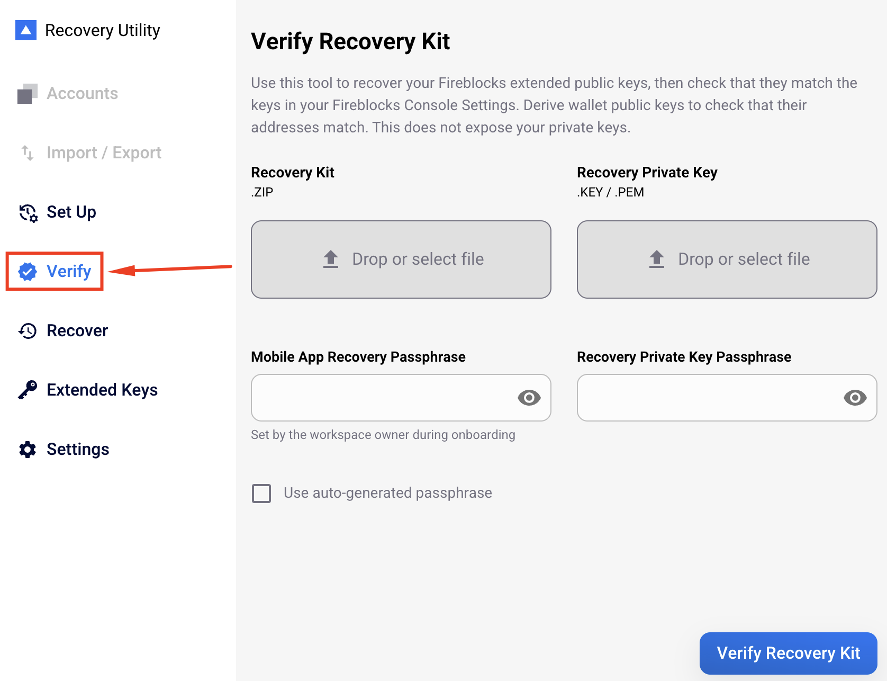

2. Fill in the needed values:

   1. `Recovery Kit` - The full recovery kit zip (either from the self-serve option or received from Fireblocks)
   2. `Recovery Private Key` - The private key file corresponding to the public key used to encrypt the recovery package
   3. `Mobile App Recovery Passphrase` - The owner's recovery passphrase
   4. `Recovery Private Key Passphrase` - The passphrase set for the recovery private key file
   5. `Use auto-generated passphrase` - Should be marked in case auto generated passphrase was used for the workspace.

    
   In the event that auto generated passphrase was used, the last option (5) should be checked, a new field will apear as well as one field will change:

   1. `Mobile App Recovery Passphrase` → `Auto-generate private key Passphrase` - the passphrase for the Auto-generate passphrase private key file
   2. `Auto-generated passphrase private key` - The private key file corresponding to the public key used to encrypt the auto-generated passphrase file

3. Once all fields are filled, click `Verify Recovery Kit` - if there will be an error it will show on the bottom left in red bold text. In events of such errors it is either:

   1. The provided passphrases / files are invalid, incorrect or corrupted
   2. There is a software issue which needs resolution, in which case a bug can be opened on Github for the project

4. Once verification finished, you will be moved to the `Extended Public Key` page, where the two text boxes will be filed with the `ECDSA` and `EdDSA` extended public keys.  These can be compared to the values in the UI:
   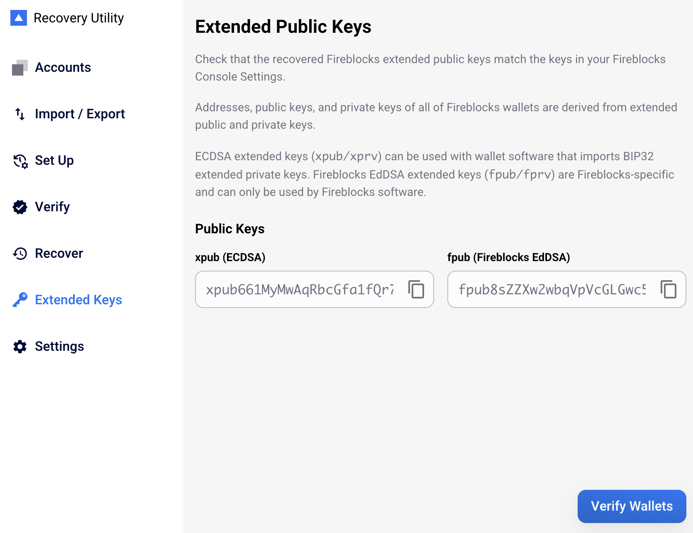

5. The `Verify Wallets` can be clicked to reconstruct the workspace and verify that the keys are in-fact derived correctly. To see how this is done see refer to the [relevant section](#reconstructing-your-workspace-post-verification-or-recovery)

##  

## <u>Recovering the Private Key Material</u>

This operation must be done from an **offline machine**

> :warning::warning::warning: **WARNING** :warning::warning::warning: 
> Performing this operation will result in your private key material being reconstructed 
> Performing this on an online machine will result in the key being considered as exposed and compromised 
> Perform this only on an offline machine

### <u>Steps</u>

1. From the main UI select the `Verify Recovery Kit`, or from the left-hand menu select the `Recover` option:
   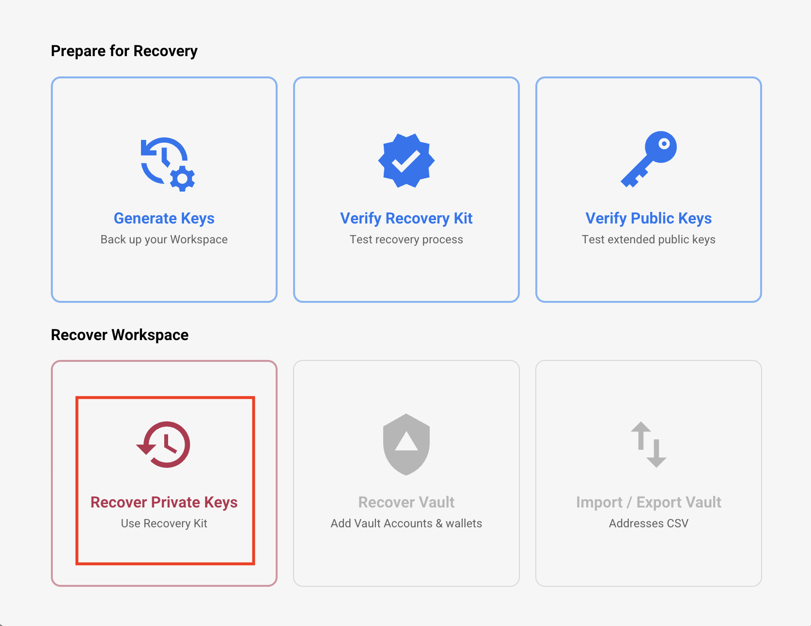
   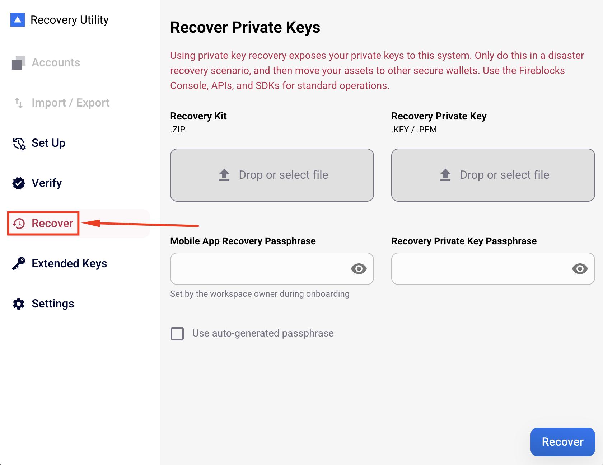

2. Fill in the needed values:

   1. `Recovery Kit` - The full recovery kit zip (either from the self-serve option or received from Fireblocks)
   2. `Recovery Private Key` - The private key file corresponding to the public key used to encrypt the recovery package
   3. `Mobile App Recovery Passphrase` - The owner's recovery passphrase
   4. `Recovery Private Key Passphrase` - The passphrase set for the recovery private key file
   5. `Use auto-generated passphrase` - Should be marked in case auto generated passphrase was used for the workspace.

    
   In the event that auto generated passphrase was used, the last option (5) should be checked, a new field will apear as well as one field will change:

   1. `Mobile App Recovery Passphrase` → `Auto-generate private key Passphrase` - the passphrase for the Auto-generate passphrase private key file
   2. `Auto-generated passphrase private key` - The private key file corresponding to the public key used to encrypt the auto-generated passphrase file

3. Once all fields are filled, click `Recover` - if there will be an error it will show on the bottom left in red bold text. In events of such errors it is either:

   1. The provided passphrases / files are invalid, incorrect or corrupted
   2. There is a software issue which needs resolution, in which case a bug can be opened on Github for the project

4. Once verification finished, you will be moved to the `Accounts` page, where you will be able to reconstruct your workspace:
   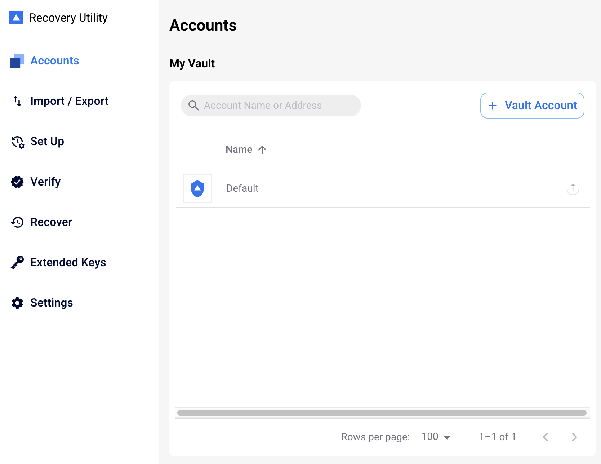

5. To reconstruct your workspace, follow the next section.

 

---

## <u>Reconstructing your Workspace Post Verification or Recovery</u>

Reconstructing your workspace will provide you with a simple way to verify individual addresses in case of verification, and allow you to access all of your funds in the event of a disaster which will madate disaster recovery.

### <u>Reconstructing the vaults themselves</u>

Reconstruction of a worksspace can be done in one of two ways:

1. Manual
2. Automated

#### <u>Manual</u>

To reconstruct your workspace manually simply select `+ Vault Account` on the `Accounts` page:
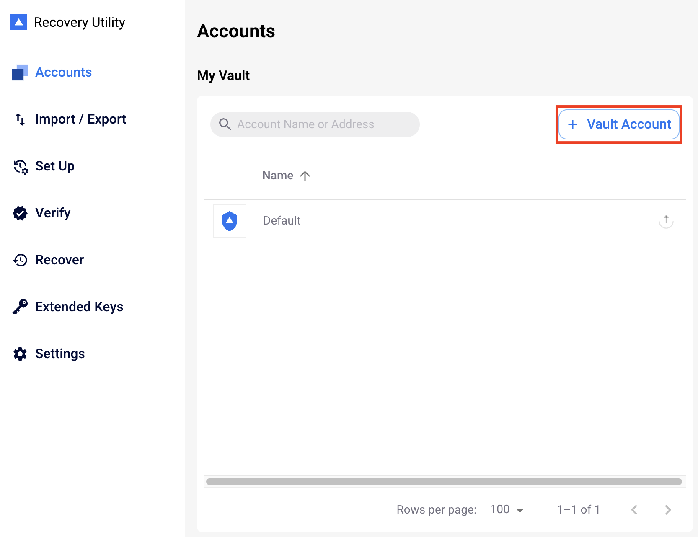

On the opened window, simply write the name of the vault account. This name does not need to match the one used in your actual workspace. Note that the IDs of the vaults created will be incremental, so the first one will be 0 (Default), followed by 1, 2, etc... Once wrote in, click `Recover`.
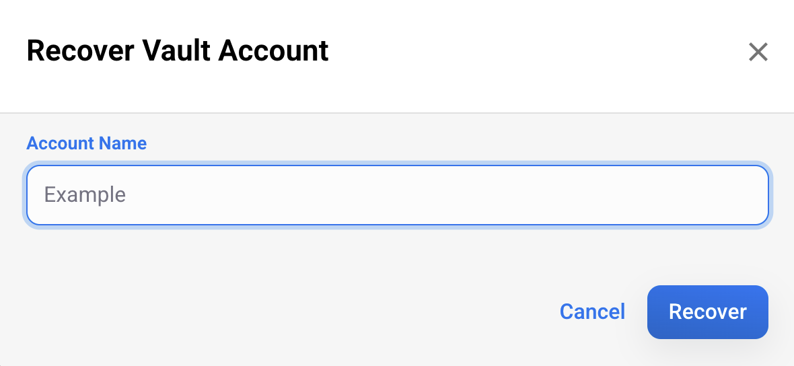

Once recovered, you will be taked to the specific vault account you just created. The ID can be seen in the bread-crumb at the top of the page. Refer to the lower section to see how to recover a specific wallet in the vault account.

#### <u>Automatic</u>

To perform an automatic reconstruction, we suggest to periodically extract vault account address list from the UI. To do this simply go into the Fireblocks console, and inside the `Accounts` tab, click on the export icon:

From the created zip, take the file _`Fireblocks_vault_addresses_YYYY_XXXX-XX-XXTXXXXXX.csv`_ which will contain the addresses.

Go to the `Import/Export` tab on the sidebar after you either recovered or verified;
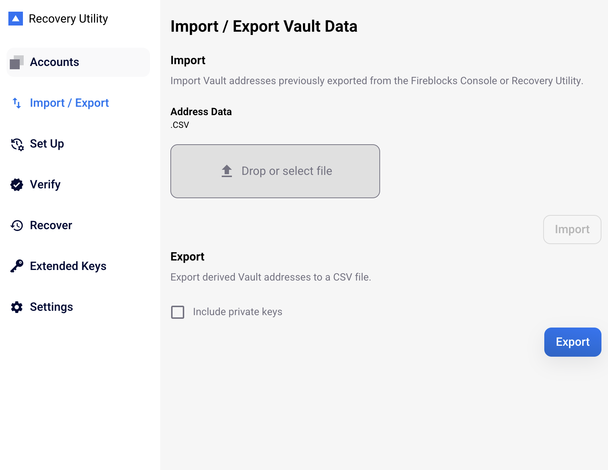

For the field `Address Data` simply upload the CSV file mentioned above and click on the `Import` button.

### <u>Reconstruct vault wallets</u>

To reconstruct the vault's wallets - which is applicable in either manual reconstruction approach, or to add a wallet to a vault which was not included as part of the .csv export used for the automatic reconstruction approach - simply click on the `+ Asset Wallet` button;
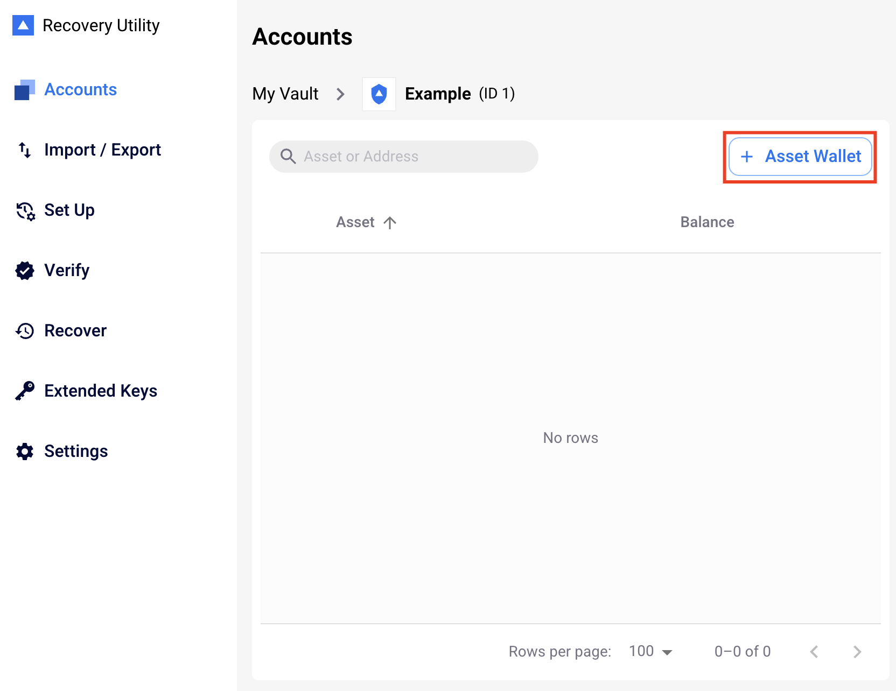

Simply select the wanted asset from the list and click `Recover`.

A new line will appear showing the wallet with two or three options after verification or recovery (accordingly):

The first two options from the left, which will always appear are:

1. Address information - this will show the address corresponding to the vault and wallet specifically

2. Key information - this will show the public key regardless of the mode (verification or recovery), but in recovery mode will also show you the private key. This is not copyable

In case of recovery specifically, a third option will be available, used to withdraw assets.
 

---

## Creating a Withdrawl Transaction

> :warning: Note :warning: 
> The relevant code parts for this section are being changed so some steps might be altered with new versions, please keep that in mind moving forward

After your private key material has been reconstructed you will be to withdraw your assets from your vault accounts using the tool.

To perform this the following setup is required:

1. An offline machine used to reconstruct the private key material
2. An online machine used to gather information for transaction creation and broadcasting the transaction
3. Both machines need to have a camera

Both machines should have the binary for the recovery tool on them and executed.

**Note:** as a safety measure, transactions can only be initiated from the offline machine.

### Steps:

1. On both machines run the binary for the recovery tool
2. On the offline machine - follow the steps to [recover the private key material](#recovering-the-private-key-material)
3. On the offline machine - click on the withdrawal button: 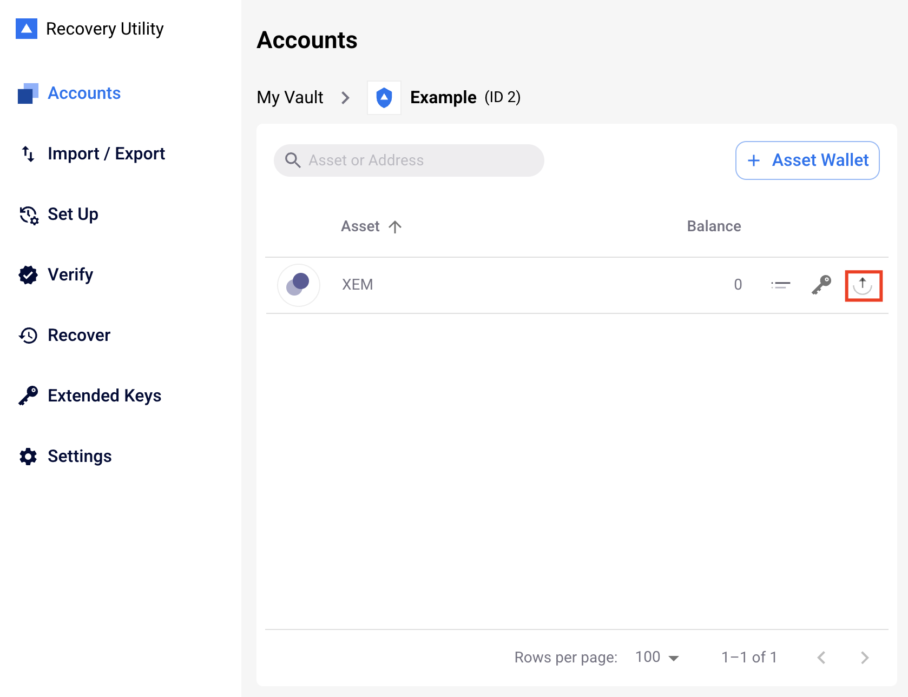
    
4. On the offline machine - fill in the destination address and click "_Create Transaction_":
   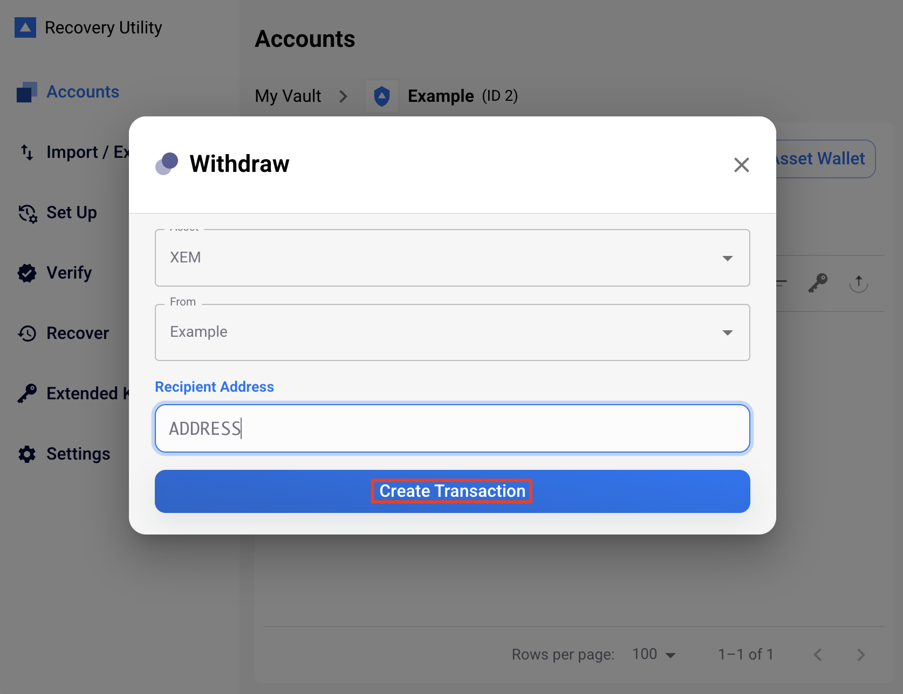
5. On the offline machine - you will be presented with a QR code. On the online machine - go to the default address for the recovery relay (defaults to https://localhost, this can be changed, see [relevant section](#change-the-default-relay-address)) and click "_Scan QR_" followed by scanning the QR from the offline machine: 
6. On the online machine - you will be presented with a dialog requesting some details; 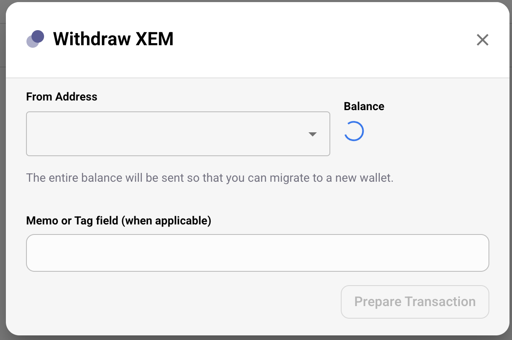

   1. `From Address` - The address from which to send the funds
   2. `Memo or Tag field` - Will appear only for relevant blockchains that have a memo or tag field. Must be provided
   3. A third varying field - A field might appear depending on the blockchain requesting additional data such as a node address, API key, or other such information

7. On the online machine - once the data is filled out, click _Prepare Transaction_, you will be presented with another QR. On the offline machine - use the camera on the offline machine to scan the QR generated on the online machine:
   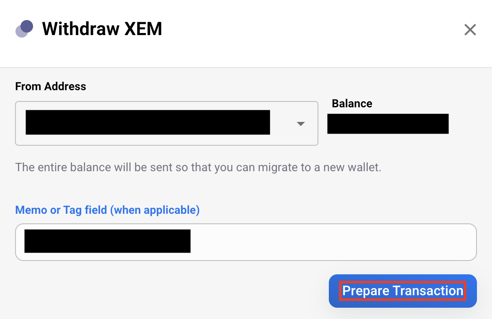

8. On the offline machine - review the transaction details (including IP and amount) and once you are **certain** you want to confirm the transaction - click _Approve Transaction_: 

9. On the online machine - scan the QR presented on the offline machine using the camera, you will be presented with an confirmation requestion, if you are **certain** you would like to send the asset, click _Confirm and Broadcast_: 

10. On the online machine - wait for a few moments as the transaction is being broadcasted, once the broadcast has finished you will be presented with a clickable hash which will take you to the relevant explorer to see the transaction itself.  In case of error it will be presented on screen.
     

---

## Configuration

There are a few configurations that can be done on the settings page.

To access the settings page click on the `Settings` option on the sidebar (only accessible via the sidebar):

### Change the Default Relay Address

As the recovery relay is a crucial part, the URL can be changed to fit your needs. To change the URL go to the settings and change the `Base URL` attribute and click `Save`.

### Reset the Workspace

After recovering the private key material, you are able to _purge_ the workspace and delete the keys from memory if needed (this will not delete any files on the drive only remove the keys from memory). 
This can be done by click on `Reset Workspace & Keys`.

### Change the Auto Reset Timeout

After some minutes of inactivity on the Recovery Utility, it will automatically _purge_ the workspace and data stored in memory. This can be changed by changing the `Auto Reset (minutes)` text field and clicking `Save`
